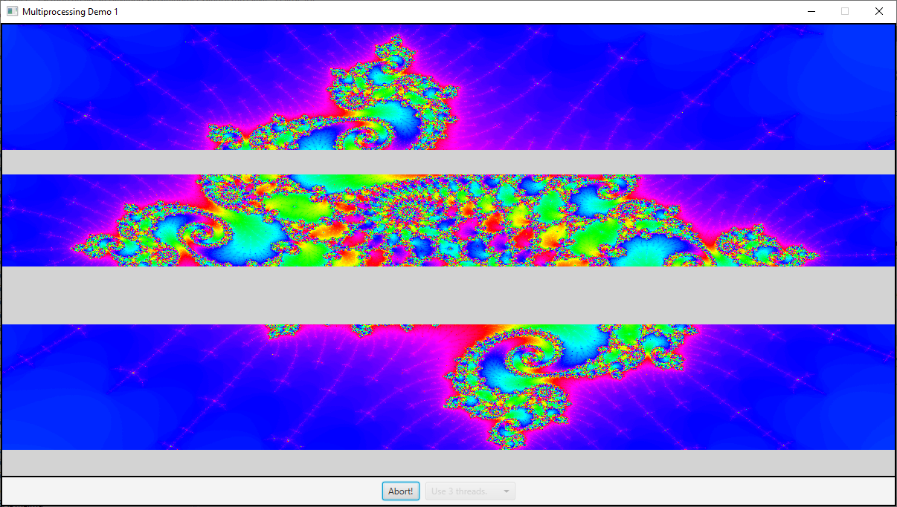
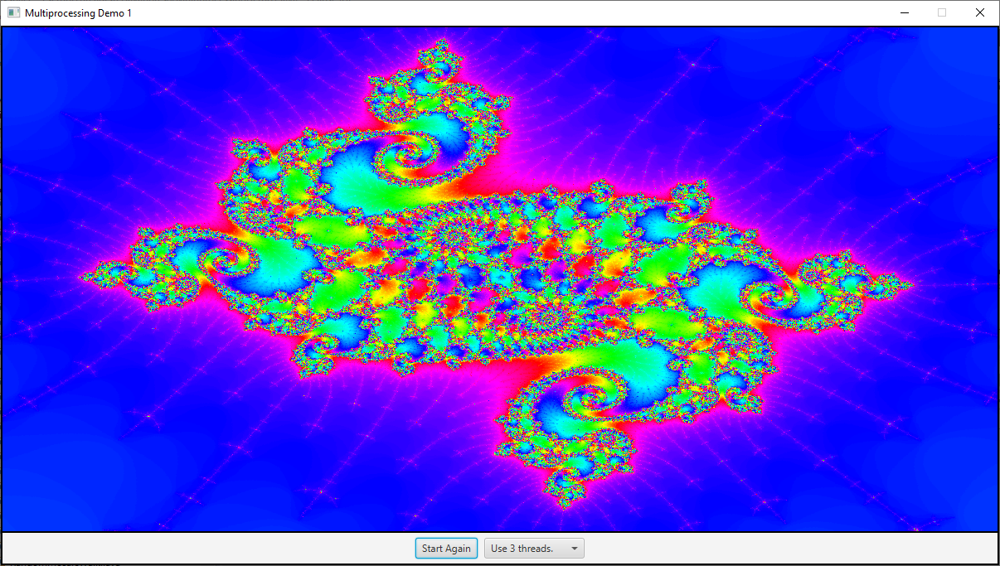

# Multiprocessing DEMO

Serie di esempi calcolo del Mandelbrot Set [https://en.wikipedia.org/wiki/Mandelbrot_set](https://en.wikipedia.org/wiki/Mandelbrot_set)  utilizzando diverse tecniche
con per suddividere la visualizzazione delle righe dell'immagine su più thread.

Pseudo codice visualizzazione:

```
for each pixel (Px, Py) on the screen do
    x0 = scaled x coordinate of pixel (scaled to lie in the Mandelbrot X scale (-2.5, 1))
    y0 = scaled y coordinate of pixel (scaled to lie in the Mandelbrot Y scale (-1, 1))
    x := 0.0
    y := 0.0
    iteration := 0
    max_iteration := 1000
    while (x×x + y×y ≤ 2×2 AND iteration < max_iteration) do
        xtemp := x×x - y×y + x0
        y := 2×x×y + y0
        x := xtemp
        iteration := iteration + 1
 
    color := palette[iteration]
    plot(Px, Py, color)

```

Esempio [BackgroundComputationDemo](./src/BackgroundComputationDemo.java) per visualizzazione con unico thread in background.

[MultiprocessingDemo1](./src/MultiprocessingDemo1.java) utilizza più thread, potendo selezionare il numero da 1 a 8. Il programma divide il compito
(task) di disegnare un'immagine in tanti sotto task e assegna ogni sottotask a
un thread.





Anche se questo funziona, c'è qualche problema: Alcuni subtask potrebbero metterci di più degli altri a completare. L'immagine viene divisa in parti uguali, ma alcune parti dell'immagine richiedono più calcoli che altre. Infatti se si fa partire la visualizzazione con tre thread, si vede che l'immagine in mezzo ci mette un po' di più a essere calcolata che quelle sopra
e sotto. In generale dividendo un problema in sottoproblemi, è molto difficile
predirre quanto tempo ci vorrà per finire ogni sottoproblema. Se ad esempio
un sottoproblema ci mette molto di più degli altri a finire. Il thread che
calcola quel sottoproblema continuerà la sua esecuzione per un tempo relativamente lungo dopo che tutti gli altri thread hanno finito. Durante
quel tempo solo **uno** dei processori del computer starà lavorando; gli altri
processori saranno a riposo.

Come semplice esempio, supponiamo da avere un computer con due processori. Dividiamo il problema in due sottoproblemi e creiamo un thread per
eseguire ogni sottoproblema. Si dovrebbe avere un tempo di esecuzione
che è la metà di quello se si utilizzasse un solo processore. Ma se invece
un sottoproblema ci impiega quattro volte di più che l'altro a risolversi, allora la maggiorparte del tempo lavorerà un solo processore. In questo caso, si avrà un guadagno di solo il 20%.

La tecnica comune per avere a che fare con queste problematiche è dividere il
problema in tanti piccoli sottoproblemi - molti più sottoproblemi di quanti sono i processori. Questo significa che ogni processore avrà da risolvere diversi sottoproblemi. Ogni volta che un processore completerà un sottoproblema, gli verrà assegnato un altro sottoproblema su cui lavorare,
finché tutti i sottoproblemi non saranno stati assegnati.

Questa è conosciuta come tecnica di **load balancing**: il carico di calcolo è
bilanciato tra tutti i processori disponibili in modo da tenerli tutti
più occupati possibile.

L'esempio [MultiprocessingDemo2](./src/MultiprocessingDemo2.java) utilizza `ConcurrentLinkedQueue<Runnable> taskQueue` per suddividere il lavoro tra i diversi thread.

L'esempio [MultiprocessingDemo3](./src/MultiprocessingDemo3.java) utilizza `LinkedBlockingQueue<Runnable> taskQueue` per suddividere il lavoro tra i diversi thread; il numero dei thread utilizzati dall'applicazione è stabilito in base al numero dei processori.

L'esempio [MultiprocessingDemo4](./src/MultiprocessingDemo4.java) è
una semplice variazione di `javanotes8.MultiprocessingDemo3` che utilizza `ExecutorService` invece di usare i thread e la blocking queue direttamente. 
